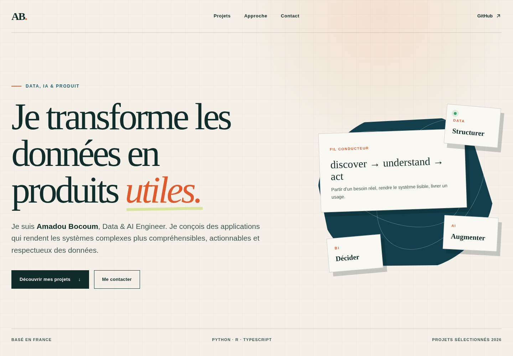

# Portfolio — Amadou Bocoum

Portfolio personnel présentant des projets à l'intersection de la data, de
l'intelligence artificielle et du développement produit.



Le design est responsive et dispose d'une mise en page dédiée aux écrans mobiles.

## Projets présentés

- **Atlas** : plateforme de mise en relation étudiante avec matching hybride ;
- **Local Hybrid RAG** : application locale pour interroger des documents avec citations ;
- **UKRA** : tableau de bord BI sur les accidents routiers au Royaume-Uni.

## Stack

- Next.js 16 ;
- React 19 ;
- TypeScript ;
- CSS natif.

Le site est exportable sous forme statique et ne dépend d'aucun service côté serveur.

## Développement local

```bash
npm install
npm run dev
```

Ouvrir ensuite [http://localhost:3000](http://localhost:3000).

Le serveur de développement utilise Webpack avec une surveillance par sondage afin
de rester fiable sur les systèmes Linux où la limite `inotify` est déjà sollicitée
par d'autres projets.

## Vérification

```bash
npm run lint
npm run build
```

Le build statique est généré dans `out/`.

## Déploiement

Le workflow `.github/workflows/deploy.yml` compile et publie automatiquement le
site sur GitHub Pages à chaque push sur `main`.

Une fois le dépôt public `Bocoum1/portfolio` créé, activer **GitHub Actions** comme
source dans `Settings > Pages`. Le site sera ensuite disponible à l'adresse :

```text
https://bocoum1.github.io/portfolio/
```

## Personnalisation restante

Avant la publication définitive, ajouter si nécessaire :

- le lien LinkedIn ;
- un CV public au format PDF ;
- le domaine final dans les métadonnées et le sitemap.
